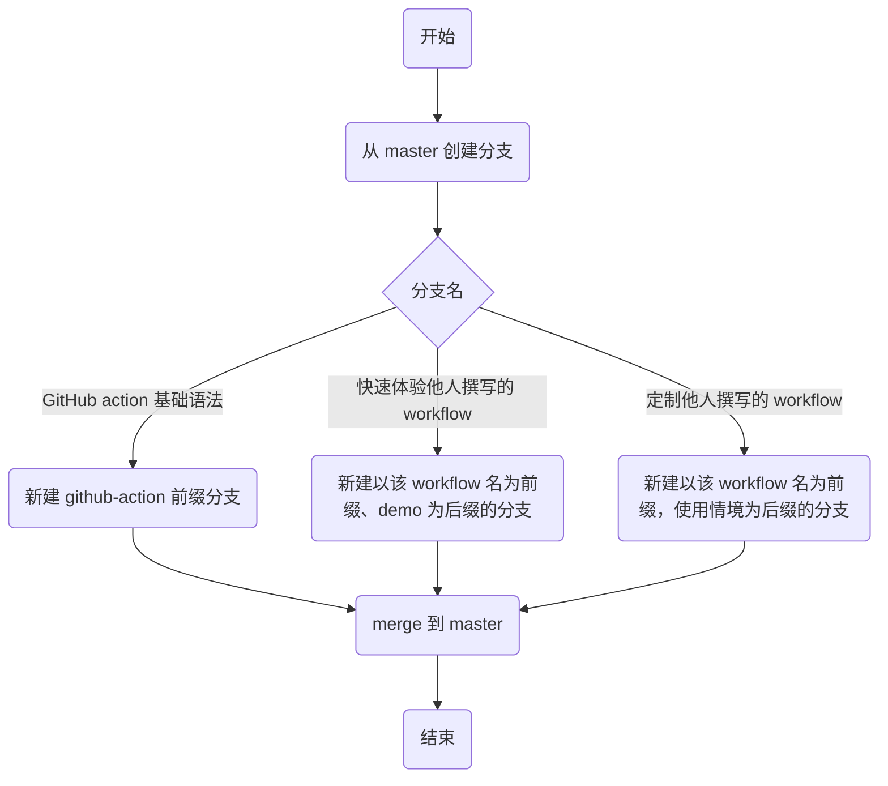

## 简介

本仓库用于

-   学习 [GitHub Action](https://docs.github.com/en/actions/quickstart) 基础用法
-   使用其他人撰写的 workflow 或 action，查看实际运行效果

## 文件结构及命名规范

文件结构如下所示

```bash
.
├── .github
│  ├── ISSUE_TEMPLATE
│  │  └── feature_request.md
│  ├── workflow-config
│  │  └── labeler.yml
│  └── workflows
│     ├── addToProject.yml
│     └── labeler.yml
└── README.md
```

注意事项

-   workflow 配置文件：部分 workflow 需要添加配置文件，将配置文件置于 `./.github/workflow-config` 下
-   workflow 配置文件命名规范：workflow 的配置文件名与 workflow 名称保持一致

## 分支命名及操作规范


